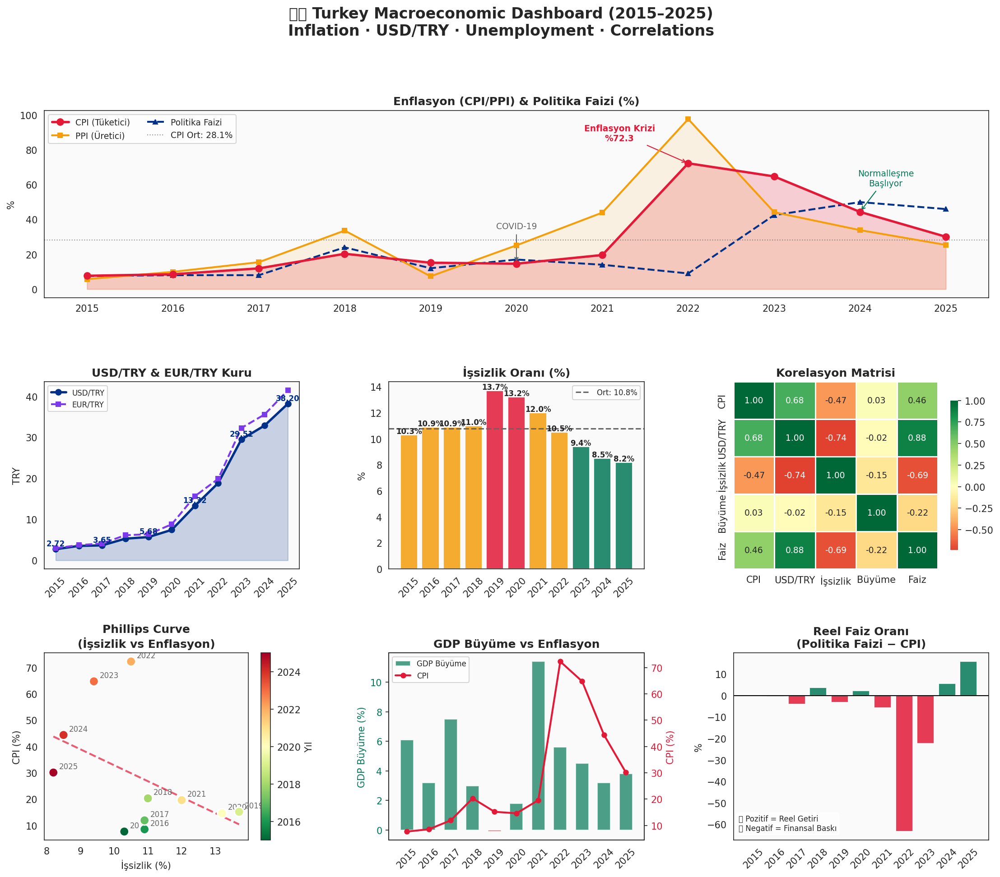
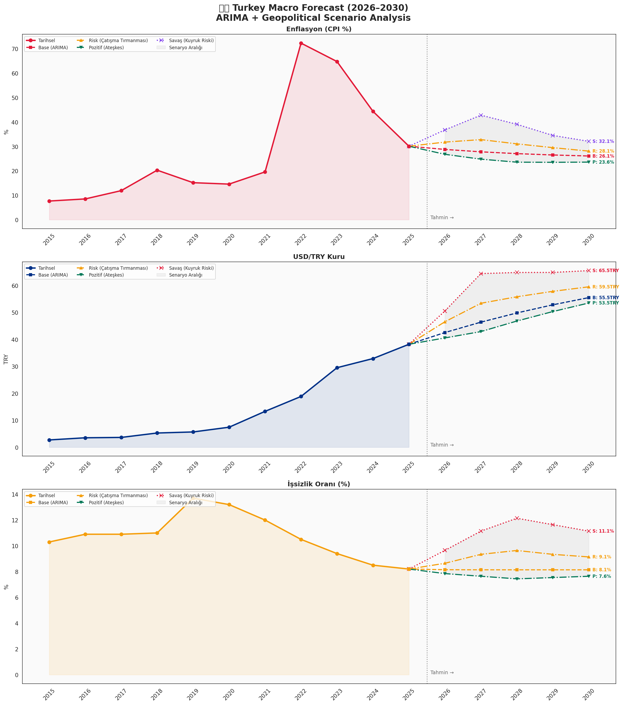

# 🇹🇷 Turkey Macroeconomic Dashboard & Forecast (2015–2030)

> 10-year analysis of Turkey's key macroeconomic indicators — Inflation (CPI/PPI), USD/TRY exchange rate, and Unemployment — with ARIMA forecasting and geopolitical scenario analysis for 2026–2030.

   

---

## 📌 Project Overview

This project performs a comprehensive macroeconomic analysis of Turkey (2015–2025) and builds ARIMA-based forecasts through 2030 with four geopolitical scenarios reflecting the current Iran-Israel-US Gulf tension environment.

**Key Questions:**
- How have Turkey's inflation, exchange rate, and unemployment evolved over 10 years?
- What do ARIMA models predict for 2026–2030 under current trends?
- How would geopolitical escalation or de-escalation affect Turkey's macro outlook?
- What does the Phillips Curve look like for Turkey?

---

## 🔍 Key Findings

| Indicator | 2015 | 2025 | Change |
|---|---|---|---|
| 📈 CPI Inflation | 7.67% | 30.10% | +292% |
| 💱 USD/TRY | 2.72 | 38.20 | **+1,304%** |
| 👥 Unemployment | 10.3% | 8.2% | -2.1pp |
| 🏦 Policy Rate | 7.5% | 46.0% | +38.5pp |
| 📉 Real Rate | -0.17% | +15.90% | First positive since 2020 |

### ARIMA Base Forecast (2026–2030)

| Year | CPI | USD/TRY | Unemployment |
|---|---|---|---|
| 2026 | 28.8% | 42.55 | 8.1% |
| 2027 | 27.8% | 46.41 | 8.1% |
| 2028 | 27.1% | 49.82 | 8.1% |
| 2029 | 26.5% | 52.84 | 8.1% |
| 2030 | 26.1% | 55.51 | 8.1% |

---

## 🌍 Geopolitical Scenario Analysis

| Scenario | Trigger | CPI 2027 | USD/TRY 2027 | Unemployment 2027 |
|---|---|---|---|---|
| 🟡 **Base** | Gulf tensions continue at low intensity | 27.8% | 46.41 | 8.1% |
| 🟠 **Risk** | Conflict escalates, oil +20%, TL pressure | 32.8% | 53.41 | 9.3% |
| 🟢 **Positive** | Ceasefire, risk appetite returns | 24.8% | 42.91 | 7.6% |
| 🔴 **War** | Full conflict, stagflation (tail risk) | 42.8% | 64.41 | 11.1% |

> **Key Insight:** Turkey is highly sensitive to Gulf geopolitical risk through three channels: energy prices (oil/gas importer), risk appetite (EM capital flows), and trade routes (Suez/Red Sea dependency).

---

## 📊 Visualizations

### 10-Year Macroeconomic Dashboard


### ARIMA Forecast + Geopolitical Scenarios (2026–2030)


---

## 🧮 Methodology

| Step | Description |
|---|---|
| 1. Data Collection | TCMB EVDS — CPI, PPI, USD/TRY, EUR/TRY, policy rate, GDP, unemployment |
| 2. Correlation Analysis | Pearson correlation matrix across all indicators |
| 3. Phillips Curve | Scatter analysis — unemployment vs inflation (Turkey) |
| 4. ADF Test | Augmented Dickey-Fuller stationarity test |
| 5. ARIMA Modeling | ARIMA(1,1,1) — differenced for non-stationary series |
| 6. Scenario Analysis | 4 geopolitical scenarios with macro shock calibration |
| 7. Visualization | 7-panel dashboard + 3-panel forecast chart |

---

## 💡 Key Structural Insights

**1. TL Depreciation — Structural, Not Cyclical**
Turkish Lira lost 1,304% vs USD over 10 years. This is not a cyclical phenomenon — it reflects chronic current account deficits, negative real rates (8 of 11 years), and institutional credibility challenges.

**2. Financial Repression (2021–2022)**
In 2022, policy rate was 9% while CPI hit 72.3% — real rate of -63.3%. This represents one of the most extreme cases of financial repression in modern EM history.

**3. Phillips Curve — Inverted for Turkey**
Turkey shows a negative CPI-unemployment correlation (-0.465). Higher inflation periods coincide with lower unemployment — consistent with demand-driven inflation cycles rather than supply shocks alone.

**4. Normalization Underway**
2024–2025 marks Turkey's first sustained positive real interest rate period since 2020. If maintained, ARIMA models suggest CPI could normalize toward 26-28% by 2030 under base case.

**5. Geopolitical Vulnerability**
USD/TRY ranges from 42.91 (ceasefire) to 64.41 (full conflict) by 2027 — a 50% spread driven purely by geopolitical scenarios. This highlights Turkey's EM vulnerability.

---

## 🛠️ Tools & Libraries

- **Python 3.10** · **pandas** · **numpy**
- **statsmodels** — ARIMA modeling, ADF test
- **matplotlib** · **seaborn** — visualization
- **scipy** — correlation analysis

---

## 📁 Repository Structure

```
turkey-macro-dashboard/
├── turkey_macro_dashboard.ipynb   ← Main analysis notebook
├── turkey_macro_dashboard.png     ← 7-panel dashboard
├── turkey_macro_forecast.png      ← ARIMA + scenario forecast
└── README.md
```

---

## ⚠️ Disclaimer

This analysis is for **educational and portfolio purposes only**. ARIMA forecasts are based on historical patterns and do not account for structural breaks or unpredictable geopolitical events. Not investment advice.

---

## 👤 Author

**Osman Manay** — Applied Economist & Data Analyst  
[LinkedIn](https://linkedin.com/in/osman-manay-48b3171ba) · [GitHub](https://github.com/pars1905)

---

*Macroeconomic Analysis · ARIMA Forecasting · Geopolitical Scenarios · Turkey · TCMB · Emerging Markets*
